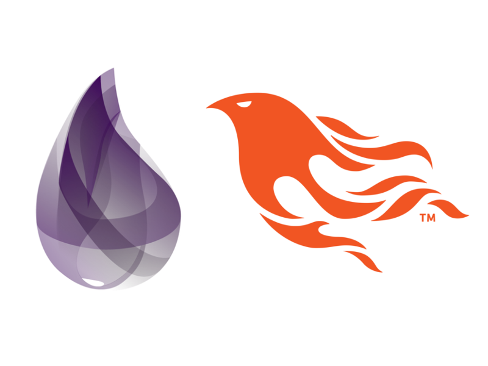

<!--
*** Thanks for checking out the Best-README-Template. If you have a suggestion
*** that would make this better, please fork the repo and create a pull request
*** or simply open an issue with the tag "enhancement".
*** Thanks again! Now go create something AMAZING! :D
-->


<!-- PROJECT SHIELDS -->
<!--
*** I'm using markdown "reference style" links for readability.
*** Reference links are enclosed in brackets [ ] instead of parentheses ( ).
*** See the bottom of this document for the declaration of the reference variables
*** for contributors-url, forks-url, etc. This is an optional, concise syntax you may use.
*** https://www.markdownguide.org/basic-syntax/#reference-style-links
-->
[![Contributors][contributors-shield]][contributors-url]
[![Forks][forks-shield]][forks-url]
[![Stargazers][stars-shield]][stars-url]
[![Issues][issues-shield]][issues-url]
[![MIT License][license-shield]][license-url]
[![LinkedIn][linkedin-shield]][linkedin-url]


<!-- PROJECT LOGO -->
<br />
<p align="center">
  <a href="https://github.com/ccr5/api-phoenix-elixir">
    
  </a>

  <h3 align="center">Phoenix API - Template</h3>

  <p align="center">
    A API using Phoenix Framework to help us!
    <br />
    <a href="https://github.com/ccr5/api-phoenix-elixir"><strong>Explore the docs »</strong></a>
    <br />
    <br />
    <a href="https://github.com/ccr5/api-phoenix-elixir/issues">Report Bug</a>
    ·
    <a href="https://github.com/ccr5/api-phoenix-elixir/issues">Request Feature</a>
  </p>
</p>


<!-- TABLE OF CONTENTS -->
<details open="open">
  <summary>Table of Contents</summary>
  <ol>
    <li>
      <a href="#about-the-project">About The Project</a>
      <ul>
        <li><a href="#built-with">Built With</a></li>
      </ul>
    </li>
    <li>
      <a href="#getting-started">Getting Started</a>
      <ul>
        <li><a href="#prerequisites">Prerequisites</a></li>
        <li><a href="#installation">Installation</a></li>
      </ul>
    </li>
    <li><a href="#roadmap">Roadmap</a></li>
    <li><a href="#contributing">Contributing</a></li>
    <li><a href="#license">License</a></li>
    <li><a href="#contact">Contact</a></li>
  </ol>
</details>


<!-- ABOUT THE PROJECT -->
## About The Project

[![Product Name Screen Shot][product-screenshot]](https://i.ytimg.com/vi/RPs4SHpSThU/maxresdefault.jpg)

This repository aims to speed up the creation of an API using Phoenix Framework for the Elixir language.

We are often anxious to start a challenging or creative part of the project, but before reaching it, it is necessary to structure, install and configure the project.

If you program in Elixir or wish to study, feel free to use this repository as you wish.

### Built With

* [Phoenix Framework](https://www.phoenixframework.org/)


<!-- GETTING STARTED -->
## Getting Started

To get a local copy up and running follow these simple example steps.

### Prerequisites

* elixir
* erlang
* postgres

### Installation

1. Clone the repo
   ```sh
   git clone https://github.com/ccr5/api-phoenix-elixir.git
   ```
2. Install MIX packages
   ```sh
   mix deps.get
   ```
3. Change DB credentials (dev.exs, test.exs)
4. Exec Ecto migrates
   ```sh
   mix ecto-migrate
   ```
4. Start Phoenix server
   ```sh
   mix phx.server
   ```


<!-- ROADMAP -->
## Roadmap

See the [open issues](https://github.com/ccr5/api-phoenix-elixir/issues) for a list of proposed features (and known issues).


<!-- CONTRIBUTING -->
## Contributing

Contributions are what make the open source community such an amazing place to be learn, inspire, and create. Any contributions you make are **greatly appreciated**.

1. Fork the Project
2. Create your Feature Branch (`git checkout -b feature/AmazingFeature`)
3. Commit your Changes (`git commit -m 'Add some AmazingFeature'`)
4. Push to the Branch (`git push origin feature/AmazingFeature`)
5. Open a Pull Request


<!-- LICENSE -->
## License

Distributed under the MIT License. See `LICENSE` for more information.


<!-- CONTACT -->
## Contact

Matheus Nobre Gomes - matt-gomes@live.com

Project Link: [https://github.com/ccr5/api-phoenix-elixir](https://github.com/ccr5/api-phoenix-elixir)

<!-- MARKDOWN LINKS & IMAGES -->
<!-- https://www.markdownguide.org/basic-syntax/#reference-style-links -->
[contributors-shield]: https://img.shields.io/github/contributors/ccr5/api-phoenix-elixir.svg?style=for-the-badge
[contributors-url]: https://github.com/ccr5/api-phoenix-elixir/graphs/contributors
[forks-shield]: https://img.shields.io/github/forks/ccr5/api-phoenix-elixir.svg?style=for-the-badge
[forks-url]: https://github.com/ccr5/api-phoenix-elixir/network/members
[stars-shield]: https://img.shields.io/github/stars/ccr5/api-phoenix-elixir.svg?style=for-the-badge
[stars-url]: https://github.com/ccr5/api-phoenix-elixir/stargazers
[issues-shield]: https://img.shields.io/github/issues/ccr5/api-phoenix-elixir.svg?style=for-the-badge
[issues-url]: https://github.com/ccr5/api-phoenix-elixir/issues
[license-shield]: https://img.shields.io/github/license/ccr5/api-phoenix-elixir.svg?style=for-the-badge
[license-url]: https://github.com/ccr5/api-phoenix-elixir/blob/main/LICENSE
[linkedin-shield]: https://img.shields.io/badge/-LinkedIn-black.svg?style=for-the-badge&logo=linkedin&colorB=555
[linkedin-url]: https://linkedin.com/in/mattnobre
[product-screenshot]: https://i.ytimg.com/vi/RPs4SHpSThU/maxresdefault.jpg
